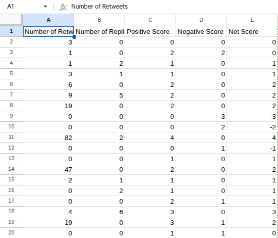
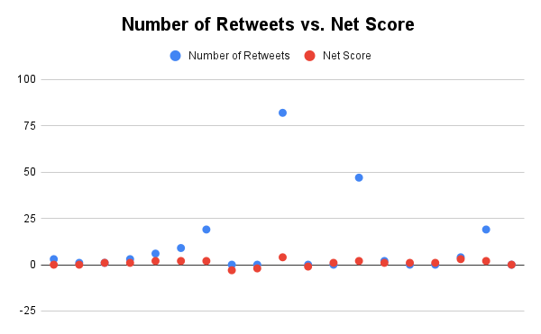

# Basic Twitter Sentiment Analyzer

This project is a simple sentiment analysis pipeline built in Python. It processes a CSV file of tweets, calculates a sentiment score for each tweet based on predefined lists of positive and negative words, and outputs the results to a new CSV file.

This was completed as the final project for the "Python Functions, Files, and Dictionaries" course in the University of Michigan's "Python 3 Programming" Specialization on Coursera.

## Project Structure

*   `/data`: Contains the input data files (`project_twitter_data.csv`, `positive_words.txt`, `negative_words.txt`).
*   `/src`: Contains the main Python logic with helper functions.
*   `sentiment_analysis.ipynb`: The Jupyter Notebook used for the main analysis pipeline.

## Core Logic

The sentiment score for each tweet is calculated using the following steps:
1.  The text of each tweet is cleaned by converting it to lowercase and stripping punctuation.
2.  Each word is then checked against the lists of positive and negative words.
3.  **Positive Score** is the total count of positive words found.
4.  **Negative Score** is the total count of negative words found.
5.  **Net Score** is calculated as: `Positive Score - Negative Score`.

## Results & Visualization

The Python script generates a `resulting_data.csv` file with the calculated sentiment scores. This data was then imported into Google Sheets for visualization and further analysis.

### Data Overview in Google Sheets

### Analysis: Number of Retweets vs. Net Score

To explore the relationship between the sentiment of a tweet and its popularity, a scatter plot was generated.

### Conclusion

For this small set of data, it is hard to see a clear connection between a tweet's score and its number of retweets. The dots on the chart are all over the place. This means a tweet can be positive or negative and still not get many retweets.

But, it is interesting that the two tweets with the most retweets were also very positive. Also, the tweets with the most negative scores had zero retweets.

This could mean that positive tweets have a better chance of becoming popular. To know for sure, we would need to study a much larger amount of data.
